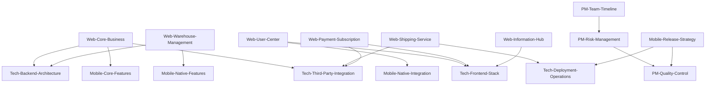

```mermaid
graph TD
    A[Web-Core-Business] --> B[Mobile-Core-Features]
    A --> C[Tech-Backend-Architecture]
    A --> D[Tech-Third-Party-Integration]

    E[Web-Warehouse-Management] --> F[Mobile-Native-Features]
    E --> C

    G[Web-Shipping-Service] --> D
    G --> H[Tech-Deployment-Operations]

    I[Web-User-Center] --> J[Tech-Frontend-Stack]
    I --> K[Mobile-Native-Integration]

    L[Web-Payment-Subscription] --> D
    L --> J

    M[Web-Information-Hub] --> J

    N[PM-Team-Timeline] --> O[PM-Risk-Management]
    O --> P[PM-Quality-Control]

    Q[Mobile-Release-Strategy] --> H
    Q --> P
```
