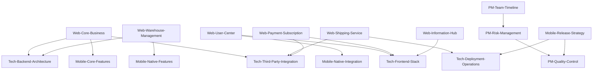

# ChinaFinds PRD 模块化文档总览

## 📋 项目概述

ChinaFinds 是一个专注于 C2M 反向代购的综合平台，包含 Web 平台、移动应用、技术架构和项目管理四大核心模块。本文档库采用模块化设计，便于不同团队协作开发和维护。

## 🗂️ 文档导航

### 📱 01-Web-Platform (Web 平台模块)

| 模块     | 文档                                                                            | 主要内容                     | 负责团队  |
| -------- | ------------------------------------------------------------------------------- | ---------------------------- | --------- |
| 代购核心 | [`Web-Core-Business.md`](./01-Web-Platform/Web-Core-Business.md)               | 商品解析、报价计算、下单流程 | 产品+后端 |
| 仓储管理 | [`Web-Warehouse-Management.md`](./01-Web-Platform/Web-Warehouse-Management.md) | 库存管理、存储费用、仓储操作 | 产品+后端 |
| 转运服务 | [`Web-Shipping-Service.md`](./01-Web-Platform/Web-Shipping-Service.md)         | 物流选择、地址管理、费用计算 | 产品+集成 |
| 用户中心 | [`Web-User-Center.md`](./01-Web-Platform/Web-User-Center.md)                   | 注册登录、资料管理、安全设置 | 前端+后端 |
| 支付订阅 | [`Web-Payment-Subscription.md`](./01-Web-Platform/Web-Payment-Subscription.md) | 支付流程、会员系统、账单管理 | 后端+集成 |
| 信息聚合 | [`Web-Information-Hub.md`](./01-Web-Platform/Web-Information-Hub.md)           | 汇率信息、政策更新、购物指南 | 前端+产品 |

### 📱 02-Mobile-App (移动端模块)

| 模块     | 文档                                                                            | 主要内容                   | 负责团队    |
| -------- | ------------------------------------------------------------------------------- | -------------------------- | ----------- |
| 核心功能 | [`Mobile-Core-Features.md`](./02-Mobile-App/Mobile-Core-Features.md)           | 主界面、导航、核心业务功能 | 移动端      |
| 专属功能 | [`Mobile-Native-Features.md`](./02-Mobile-App/Mobile-Native-Features.md)       | 扫码、语音、推送、社交分享 | 移动端      |
| 原生集成 | [`Mobile-Native-Integration.md`](./02-Mobile-App/Mobile-Native-Integration.md) | 相机、生物识别、离线功能   | 移动端      |
| 发布策略 | [`Mobile-Release-Strategy.md`](./02-Mobile-App/Mobile-Release-Strategy.md)     | 应用商店、ASO、版本发布    | 移动端+运营 |

### 🏗️ 03-Technical-Architecture (技术架构模块)

| 模块       | 文档                                                                                              | 主要内容                         | 负责团队    |
| ---------- | ------------------------------------------------------------------------------------------------- | -------------------------------- | ----------- |
| 前端技术栈 | [`Tech-Frontend-Stack.md`](./03-Technical-Architecture/Tech-Frontend-Stack.md)                   | Next.js、React Native、UI 组件库 | 前端+移动端 |
| 后端架构   | [`Tech-Backend-Architecture.md`](./03-Technical-Architecture/Tech-Backend-Architecture.md)       | API 设计、数据库、缓存策略       | 后端+架构   |
| 第三方集成 | [`Tech-Third-Party-Integration.md`](./03-Technical-Architecture/Tech-Third-Party-Integration.md) | 支付、物流、商品解析服务         | 后端+集成   |
| 部署运维   | [`Tech-Deployment-Operations.md`](./03-Technical-Architecture/Tech-Deployment-Operations.md)     | 部署、监控、安全、性能优化       | DevOps+架构 |

### 📊 04-Project-Management (项目管理模块)

| 模块       | 文档                                                                      | 主要内容                     | 负责团队    |
| ---------- | ------------------------------------------------------------------------- | ---------------------------- | ----------- |
| 团队时间线 | [`PM-Team-Timeline.md`](./04-Project-Management/PM-Team-Timeline.md)     | 团队结构、开发计划、协作工具 | 项目管理    |
| 风险管理   | [`PM-Risk-Management.md`](./04-Project-Management/PM-Risk-Management.md) | 技术风险、团队风险、应急预案 | 项目管理    |
| 质量控制   | [`PM-Quality-Control.md`](./04-Project-Management/PM-Quality-Control.md) | 代码标准、验收清单、测试流程 | QA+项目管理 |

## 🔄 模块依赖关系

## 📚 使用指南

### 👥 团队协作

- **产品团队**: 重点关注 Web 平台和移动端的功能模块
- **开发团队**: 重点关注技术架构和具体实现模块
- **项目管理**: 重点关注项目管理模块和整体进度
- **QA 团队**: 重点关注质量控制和验收标准

### 📖 阅读顺序

1. **新手入门**: README → 核心业务模块 → 用户中心模块
2. **技术实现**: 技术架构模块 → 具体功能模块
3. **项目管理**: 项目管理模块 → 风险和质量控制

### ✏️ 更新维护

- 每个模块由对应的负责团队维护
- 涉及跨模块的变更需要相关团队协调
- 重大架构变更需要通过技术委员会 review

## 🎯 关键概念

### 业务术语

- **C2M**: Customer to Manufacturer，反向代购模式
- **代购申请**: 用户提交的商品购买需求
- **转运服务**: 将仓储商品配送到用户指定地址
- **存储费用**: 商品在仓库存储产生的费用

### 技术术语

- **商品解析**: 从电商平台链接自动提取商品信息
- **实时报价**: 基于商品价格、汇率、服务费的动态计算
- **RLS**: Row Level Security，数据库行级安全策略
- **ASO**: App Store Optimization，应用商店优化

## 📞 联系方式

- **项目负责人**: 刘骏 (liujun@chinafinds.com)
- **技术架构**: 待确定
- **产品经理**: 待招募
- **项目状态**: 开发中

## 📅 最后更新

- **日期**: 2025-06-17
- **版本**: v1.0
- **更新内容**: 初始模块化拆分完成

---

**🔗 快速链接**

- [项目拆分计划](./ChinaFinds-PRD-Split-Plan.md)
- [模块依赖关系](./Module-Dependencies.md)
- [术语表](./Glossary.md)
